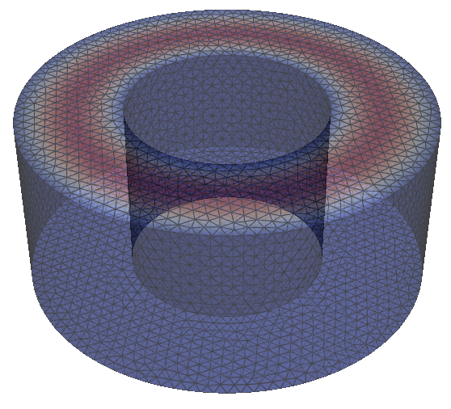

# nv-resonator

## Installation

```bash
conda create -yn nv-resonator
conda activate nv-resonator
conda install -yc conda-forge fenics-dolfinx=0.7 pyvista libstdcxx-ng gmsh
pip install gmsh
```

## Simulation

First, generate a mesh:

```bash
python mesh.py ring
```


```
Info    : Writing 'ring.msh'...
Info    : Done writing 'ring.msh'
Cavity frequency is approximately 6.5309 GHz
```

Then, to find more exact microwave modes:

```bash
python sim.py ring.msh
```



```
Resonant frequencies (GHz):
Mode 1: 0.0477 GHz
Mode 2: 0.0477 GHz
Mode 3: 0.0477 GHz
Mode 4: 0.0477 GHz
Mode 5: 6.4408 GHz
Mode 6: 6.5915 GHz
Mode 7: 6.5934 GHz
Mode 8: 7.0261 GHz
Mode 9: 7.0285 GHz
Mode 10: 7.6955 GHz
Mode 11: 7.6971 GHz
Mode 12: 8.2446 GHz
```