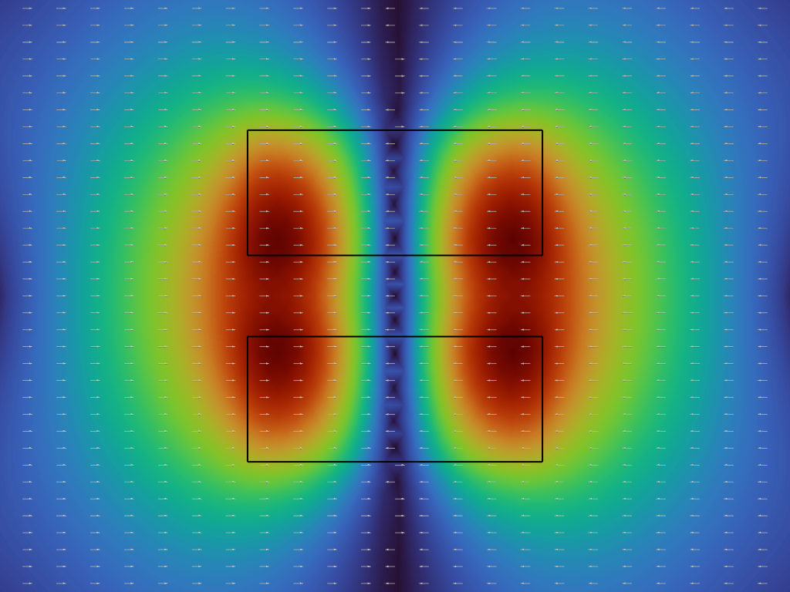
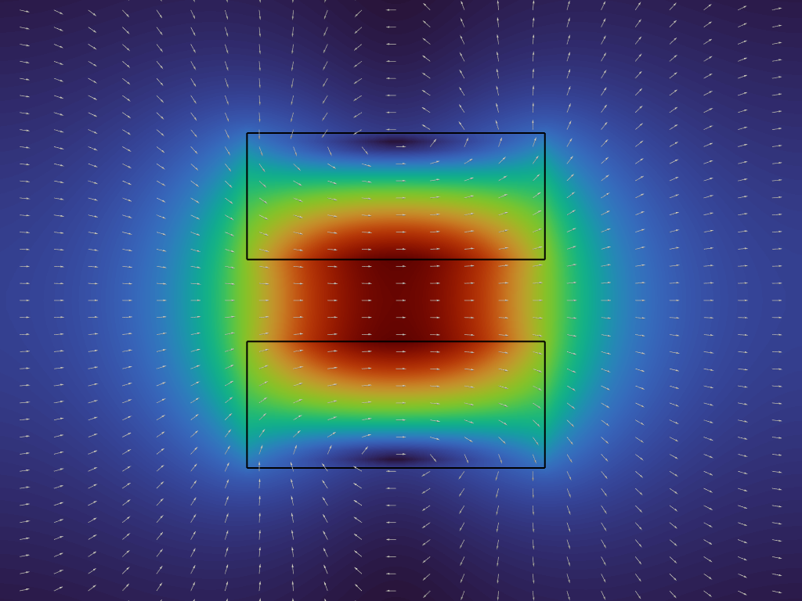

# nv-resonator

## Installation

```bash
conda create -yn nv-resonator
conda activate nv-resonator
conda install -yc conda-forge fenics-dolfinx=0.7 petsc=*=complex* pyvista libstdcxx-ng gmsh scipy
pip install gmsh
```

## Running

To generate a mesh,

```bash
gmsh mesh/resonator.geo -2
```

You can view it with

```bash
gmsh mesh/resonator.msh
```

<div style="text-align: center">
    
</div>

We're looking for radial or axial modes, so we only need to simulate a longitudinal slice parallel to the ring's axis. Rotating around the bottom edge will give the full ring. To create images of the wave modes, run

```bash
python modes.py
```

It should save them in `images/modes/<freq>.png`. Here's an example of the electric field:

<div style="text-align: center">
    
</div>

and the magnetic field:

<div style="text-align: center">
    
</div>

## TODO

- [ ] The magnetic field solver is using Nedelec elements because they are curl conforming. However, that is in Cartesian coordinates, not cylindrical, which creates a 2-3\% error in resonance frequency. We need to either create cylindrical Nedelec elements, or modify the solver. I'm leaning towards the former.

## Theory

<div style="text-align: center">
    
</div>

In [Cavity-Enhanced Microwave Readout of a Solid-State Spin Sensor](https://www.nature.com/articles/s41467-021-21256-7) by Dirk Englund, et al., they use dielectric resonators to couple with an NV center. Their resonators have the following parameters:

```
outer_radius (a) = 8.17e-3
inner_radius (b) ~ 4e-3
height       (L) = 7.26e-3
permittivity (ε) ~ 34
```

The readout frequency of an NV center is ~2.87 GHz, so they want to tune the cavity to have a mode ~3 GHz. Their simulation (above) places the diamond between two resonators as a source. A cylindrical resonator's $TE_{01n}$ mode is approxmately

$$\frac{0.034 (a/L + 3.45)}{a\sqrt{\epsilon}} GHz,$$

given by Kajfez & Guillon in [Dielectric resonators](https://search.worldcat.org/en/title/927557286) and readily available on [Wikipedia](https://en.wikipedia.org/wiki/Dielectric_resonator#Theory_of_operation). This approximation yields resonance ~2.86 GHz, and their simulation is ~2.90 GHz.

Our system is slightly different. They used an aluminum shield, but that is only important for increasing the relaxation time. Since we are using ours only as a magnetometer, it is fine to leave it open to the air. In addition, we are using an LED instead of a LASER, so we can place the diamond at one end of a longer ring, rather than orienting it between two smaller rings. The simplified resonator is defined in `mesh/resonator.geo`, while a reconstruction of their double-resonator is found in `mesh/double.geo`.

## Weak Formulation

Starting from Maxwell's equations,

$$\begin{aligned}
\nabla \cdot E &= \rho = 0&\text{(in a dielectric)}\\
\nabla \cdot B &= 0\\
\nabla \times E &= -\frac{\partial B}{\partial t}\\
\nabla \times \left(\frac{1}{\mu} B\right) &= J + \varepsilon\frac{\partial E}{\partial t} = \varepsilon\frac{\partial E}{\partial t} &\text{(in a dielectric),}\\
\end{aligned}$$

where $\mu_r, \varepsilon_r$ are the relative permeability and permittivity of the material. Assuming we have a mode

$$B, E\sim e^{i(kx - \omega t)},$$

we get

$$\nabla \times \left(\frac{1}{\mu_r}\nabla\times E\right) = \varepsilon_r k^2E.$$

Since

$$\nabla \times (\nabla\times E) = \nabla(\nabla\cdot E) - \nabla^2 E,$$

this reduces to

$$-\nabla^2 \frac{1}{\mu_r}E = \varepsilon_r k^2E.$$

In cylindrical coordinates, and assuming $E_\theta = 0$, this is

$$\begin{aligned}
-\nabla^2 \frac{1}{\mu_r}E_z &= \varepsilon_r k^2E_z\\
-\nabla^2 \frac{1}{\mu_r}E_r + \frac{E_r}{r^2} &= \varepsilon_r k^2E_r\\
\end{aligned}$$

The weak formulation is

$$-\left\langle \nabla^2 \frac{1}{\mu_r}E_z, v\right\rangle = k^2\left\langle \varepsilon_rE_z, v\right\rangle
\iff
\left\langle \nabla \frac{1}{\mu_r}E_z, \nabla v\right\rangle - \int \frac{1}{\mu_r}\frac{E_z}{\partial \hat{n}} v\mathrm{d}S = k^2\left\langle \varepsilon_rE_z, v\right\rangle.$$

The Sommerfeld radiation boundary condition is

$$\frac{E_z}{\partial \hat{n}} = jk E_z,$$

so we're left with

$$\left\langle \nabla \frac{1}{\mu_r}E_z, \nabla v\right\rangle - jk \int \frac{1}{\mu_r}E_z v\mathrm{d}S = k^2 \left\langle \varepsilon_rE_z, v\right\rangle.$$

Letting $\lambda = -jk$, this is a quadratic eigenvalue problem of the form

$$\lambda^2 A + \lambda B + C = 0,$$

where

$$\begin{aligned}
A &= \left\langle \varepsilon_r E_z, v\right\rangle &\text{(mass matrix)}\\
B &= \int \frac{1}{\mu_r}E_z v\mathrm{d}S &\text{(boundary condition)}\\
C &= \left\langle \nabla \frac{1}{\mu_r}E_z, \nabla v\right\rangle &\text{(stiffness matrix)}.
\end{aligned}$$

The derivation for $E_r$ is similar, though we need to adjust

$$C = \left\langle \nabla \frac{1}{\mu_r}E_r, \nabla v\right\rangle + \left\langle \frac{1}{\mu_r r}E_r, v\right\rangle.$$

Finally, we only apply the radiation boundary condition along the three non-axial edges of our mesh. The axis just has the Dirichlet $E_r = 0$ condition. To find the magnetic field, we replace $E\mapsto \times B$, and $\varepsilon_r\leftrightarrow \mu_r$:

$$\begin{aligned}
A &= \left\langle \mu_rB_z, v\right\rangle &\text{(mass matrix)}\\
B &= \int (\hat{n}\times (\hat{n}\times \frac{1}{\varepsilon_r}B_z)) v\mathrm{d}S &\text{(boundary condition)}\\
C &= \left\langle \nabla\times \frac{1}{\varepsilon_r}B_z, \nabla\times v\right\rangle &\text{(stiffness matrix)}.
\end{aligned}$$
