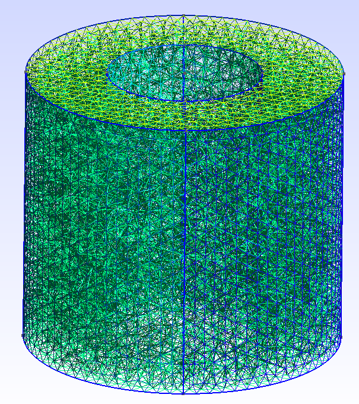
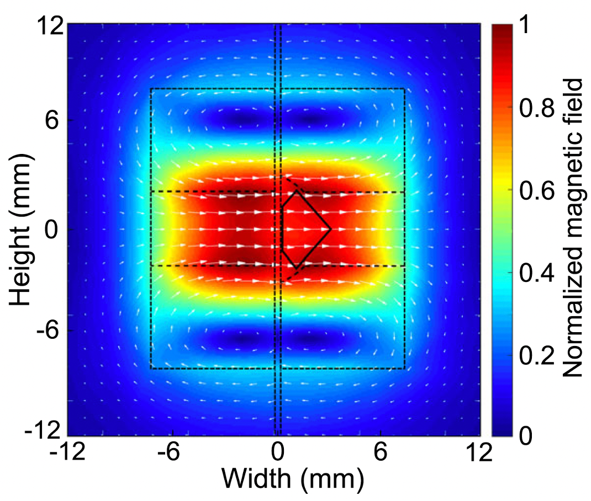
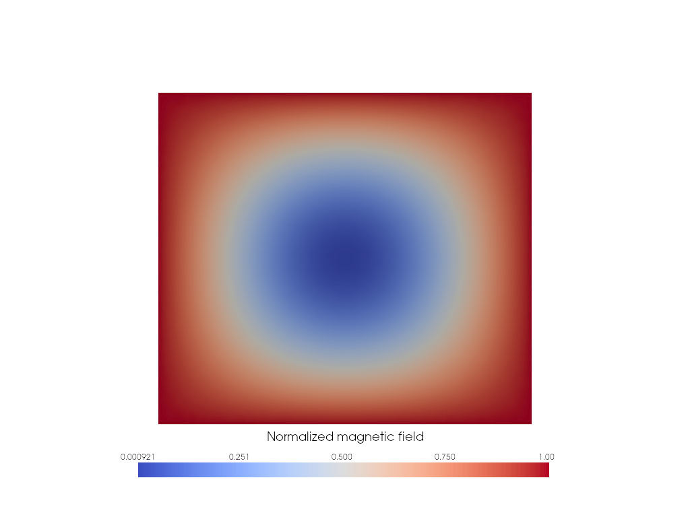
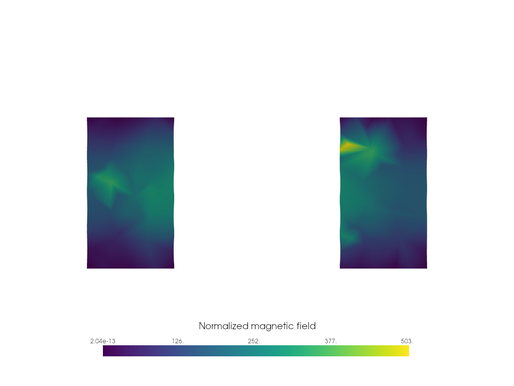

# nv-resonator

## Installation

```bash
conda create -yn nv-resonator
conda activate nv-resonator
conda install -yc conda-forge fenics-dolfinx=0.7 pyvista libstdcxx-ng gmsh
pip install gmsh
```

## Running

<div style="text-align: center">
    
</div>

To generate a mesh,

```bash
python mesh.py ring # or cylinder
```

To run a simulation,

```bash
python sim.py ring # or cylinder
```

## Theory

In [Cavity-Enhanced Microwave Readout of a Solid-State Spin Sensor](https://www.nature.com/articles/s41467-021-21256-7) by Dirk Englund, et al., they stack two resonators with

```
outer_radius (a) = 8.17e-3
inner_radius (b) ~ 4e-3
height       (L) = 7.26e-3
permittivity (ε) ~ 34
```

<div style="text-align: center">
    
</div>

The readout frequency of an NV center is ~2.87 GHz, so they want to tune the cavity to have a mode ~3 GHz. Their simulation (above) assumes the two resonators are cylinders. A decent approximation for the first transverse electric mode is

$$\frac{34 (a/L + 3.45)}{a\sqrt{\epsilon}} GHz,$$

given by Kajfez & Guillon in [Dielectric resonators](https://search.worldcat.org/en/title/927557286) and readily available on [Wikipedia](https://en.wikipedia.org/wiki/Dielectric_resonator#Theory_of_operation).

This approximation yields ~2.86 GHz. A numerical simulation yields 3.00 GHz. However, to place their diamond inside the cavity, they had to cut a hole through the middle. This significantly changes the available modes, as the 3.00 GHz mode has its extrema in the center.

<div style="text-align: center">
    
</div>

Once the hole is accounted for, the resonance frequency doubles to ~6.44 GHz.

<div style="text-align: center">
    
</div>